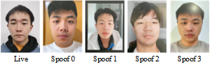

<!--
 * @FilePath: README.md
 * @Author: erchen
 * @Date: 2023-11-07 17:07:26
 * @LastEditTime: 2023-11-17 02:25:22
 * @Descripttion: 
-->

# face action presentation attack (FAPA) test dataset

We collected a high-quality facial action presentation attack dataset. Live videos involve subjects making actions such as opening mouths and closing eyes in different scenarios. Spoof videos are high-definition recordings that replay live videos in diverse environments. The specific configurations for different environments are shown in table.

[^1]: 
| Label | Edge | Light | Brightness |
|---------|---------|---------|---------|
| Spoof 0 | No | No | High |
| Spoof 1 | Yes | No | High |
| Spoof 2 | No | No | Low |
| Spoof 3 | No | Yes | High |

"Edge" indicates whether the recorded video contains video edges. "Light" signifies the presence of an external movable light source during video recording. "Brightness" refers to the brightness of the playback device. The resolution ratio of all videos is 4:3, at which point the image can be captured to the maximum field of view. Sample Spoof 0 serves as the baseline spoof, while the other spoof samples are based on Spoof 0 with modifications for different experimental conditions.This dataset has significant differences in lighting, image quality, and background, as shown in the figure. 

It will help ensure that the model can withstand various types of demonstration attacks. Spoof videos are recorded with high-definition cameras, which poses certain challenges for live detection. We have created a test set from a subset of this dataset, which consists of 320 live videos and 320 spoof videoss, as shown in the table.

| Live | Spoof 0 | Spoof 1 | Spoof 2 | Spoof 3 |
|---------|---------|---------|---------|---------|
| 320 | 80 | 80 | 80 | 80 |

The naming format for all videos is AB_CD_E.mp4. 'AB' is the volunteer's ID. 'C' denotes the sequence of multiple videos recorded by the volunteer. 'D' indicates the action in the video, where '0' stands for opening mouth, and '1' stands for closing eyes. 'E' signifies the category of the video, with '0' being live, and the rest representing various types of spoof.